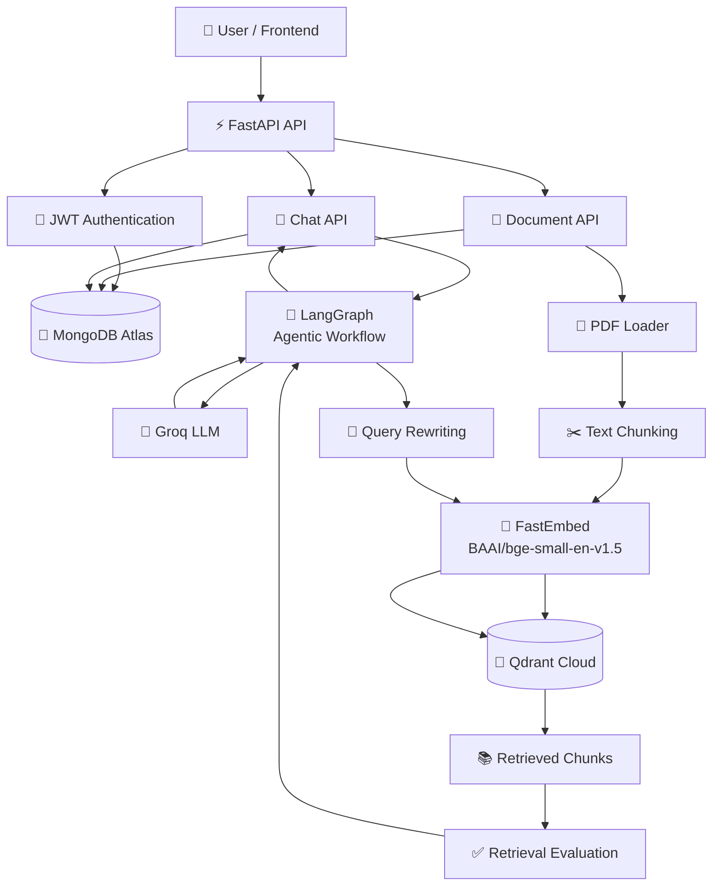
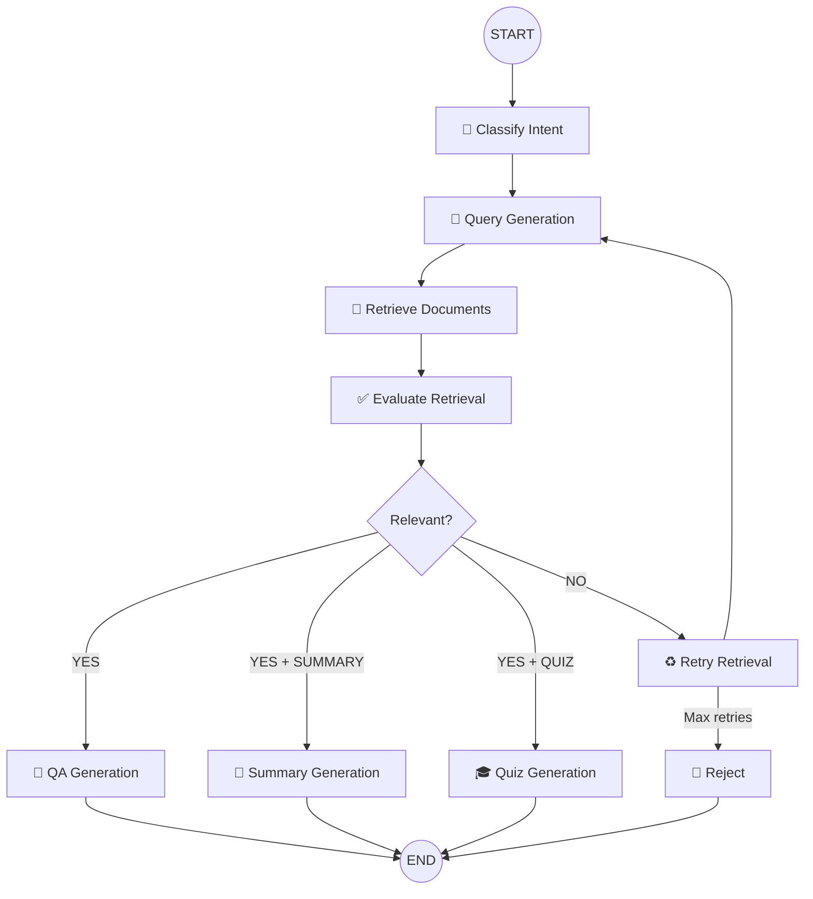
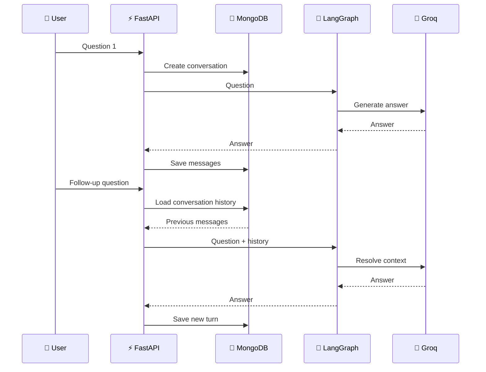
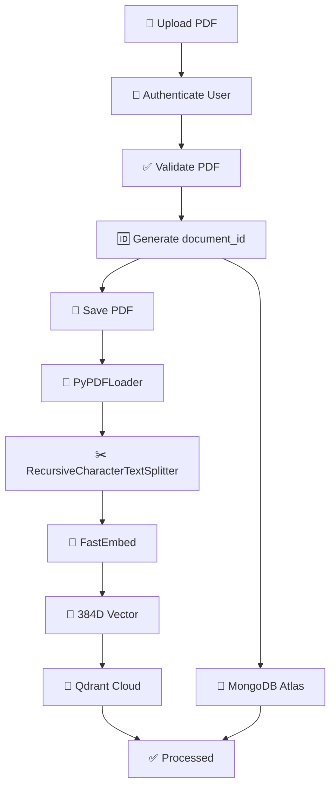
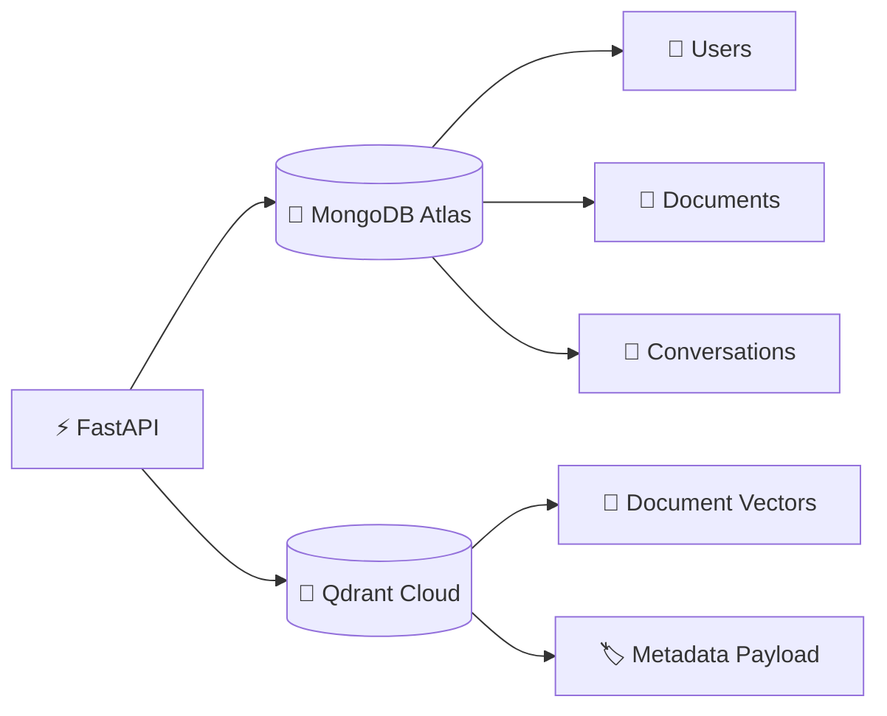
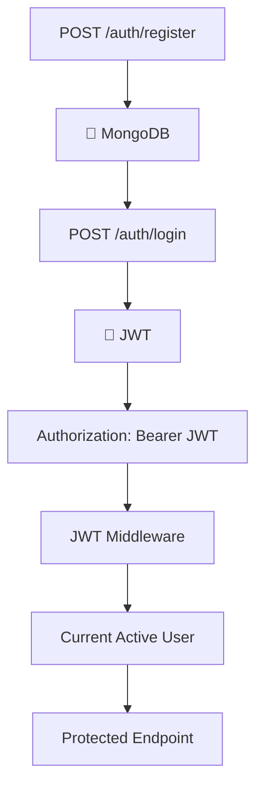
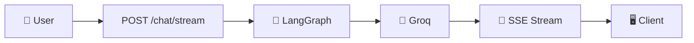
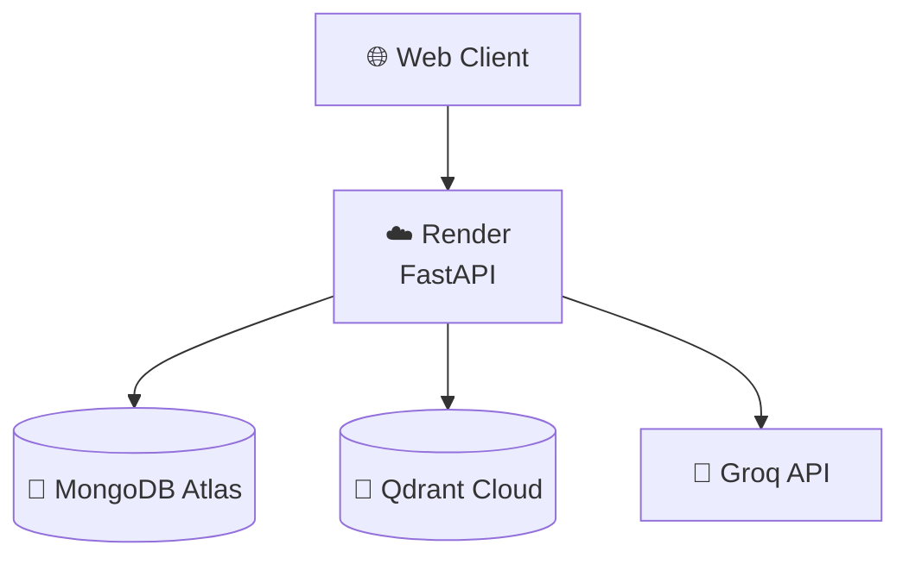
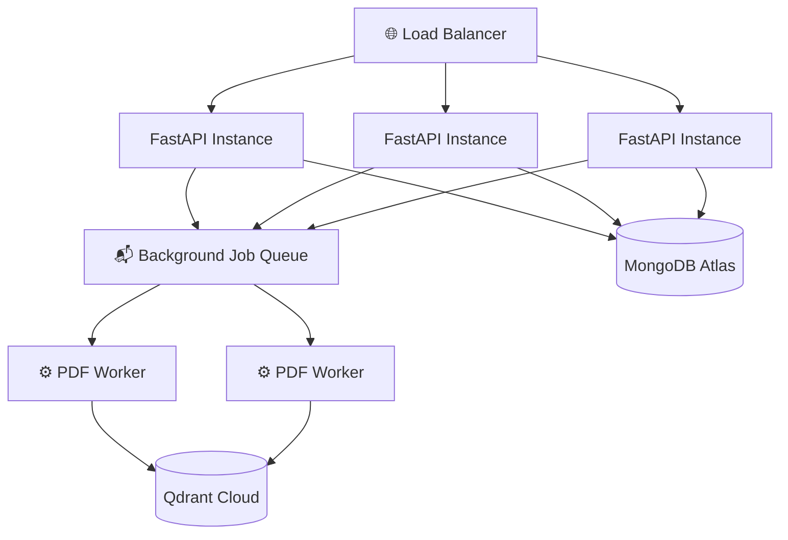

# 🤖 AI Study Assistant — RAG + Agentic RAG

<p align="center">
  <strong>An AI-powered document study assistant built with FastAPI, LangGraph, Groq, Qdrant, MongoDB Atlas, and FastEmbed.</strong>
</p>

<p align="center">


</p>

<p align="center">
  <a href="https://rag-ai-assistant-2lze.onrender.com">Live API</a> •
  <a href="https://rag-ai-assistant-2lze.onrender.com/docs">Swagger Docs</a>
</p>

---

## 🌟 Overview

**AI Study Assistant** is a multi-user Retrieval-Augmented Generation application that allows users to upload PDF documents and interact with them using natural language.

Instead of sending a question directly to an LLM, the application:

```text
User Question
     ↓
Conversation Memory
     ↓
Intent Classification
     ↓
Query Rewriting
     ↓
FastEmbed
     ↓
Qdrant Vector Search
     ↓
User Isolation Filter
     ↓
Retrieved Context
     ↓
Retrieval Evaluation
     ↓
Agentic Routing
     ↓
Groq LLM
     ↓
Grounded Answer + Sources
```

The system supports:

* 📄 PDF upload and document ingestion
* 🔎 Semantic vector retrieval
* 🧠 Query rewriting
* 💬 Conversation memory
* 🤖 Agentic RAG with LangGraph
* 🧩 QA / SUMMARY / QUIZ intent routing
* 📊 Retrieval evaluation
* 🔐 JWT authentication
* 👤 Multi-user document isolation
* 📚 Qdrant vector storage
* 🗄️ MongoDB application metadata
* ⚡ Streaming responses
* 🌐 Cloud deployment

The architecture follows the separation of responsibilities described in the project handbook: FastAPI handles HTTP orchestration, services contain RAG/LLM logic, MongoDB stores application metadata, and Qdrant handles vector retrieval.

---

# 🚀 Live Deployment

### Backend

**Render**

https://rag-ai-assistant-2lze.onrender.com

### API Documentation

https://rag-ai-assistant-2lze.onrender.com/docs

You can use Swagger UI to inspect and manually test all exposed endpoints.

---

# 🏗️ System Architecture



---

# 🧠 RAG Architecture

The core RAG pipeline is:

```mermaid
flowchart LR

    A["User Question"]
    B["Query Rewriter"]
    C["FastEmbed"]
    D["Qdrant Search"]
    E["User Filter"]
    F["Top-K Chunks"]
    G["Retrieval Evaluation"]
    H["Context Builder"]
    I["Groq LLM"]
    J["Grounded Answer"]
    K["Sources"]

    A --> B
    B --> C
    C --> D
    D --> E
    E --> F
    F --> G
    G --> H
    H --> I
    I --> J
    J --> K
```



### Step-by-step

### 1. User Question

The user asks something such as:

```text
What certifications are mentioned in my resume?
```

### 2. Query Rewriting

The original natural-language question is transformed into a retrieval-friendly search query.

Example:

```text
Original:
What certifications are mentioned in my resume?

Rewritten:
certifications in resume
```

This is particularly useful for conversational queries such as:

```text
Which one was completed in 2025?
```

because the system can use conversation history to understand what **“which one”** refers to. The project handbook describes query rewriting specifically for follow-up questions.

### 3. Embedding

The rewritten query is converted into a vector using:

```text
BAAI/bge-small-en-v1.5
```

through FastEmbed.

### 4. Vector Search

The query vector is sent to Qdrant.

Qdrant retrieves semantically similar document chunks.

### 5. User Isolation

Every retrieval is restricted by the authenticated user's:

```text
user_id
```

This prevents one user from retrieving another user's document chunks. The project architecture explicitly uses `user_id` filtering for this purpose.

### 6. Retrieval Evaluation

The retrieved context is evaluated before generation.

```text
Relevant?
   │
   ├── YES → Generate
   │
   └── NO  → Retry / Reject
```

The project uses an LLM-based retrieval evaluator that returns a boolean relevance decision.

### 7. Grounded Generation

The final LLM receives:

```text
Conversation History
+
Retrieved Document Context
+
Current Question
```

The prompt instructs the model to use the document context as the source of truth and not invent unavailable information.

### 8. Sources

The API returns source metadata:

```json
{
  "filename": "resume.pdf",
  "page": 0,
  "document_id": "..."
}
```

---

# 🤖 Agentic RAG with LangGraph

The application uses LangGraph to orchestrate multiple states and decisions.



The graph maintains state and uses conditional routing instead of implementing the entire workflow as one large function.

---

# 🎯 Intent Classification

The system supports three primary intents:

| Intent    | Example                       | Workflow                      |
| --------- | ----------------------------- | ----------------------------- |
| `QA`      | What technologies are listed? | Retrieve → Evaluate → Answer  |
| `SUMMARY` | Summarize my internship       | Retrieve → Evaluate → Summary |
| `QUIZ`    | Create 5 MCQs                 | Retrieve → Evaluate → Quiz    |

This makes the API response easy to inspect during testing and allows LangGraph to route requests to specialized nodes.

---

# 💬 Conversation Memory

Conversation history is stored in MongoDB.



Example:

```text
Q1:
What certifications do I have?

Q2:
Which one was completed in 2025?

Q3:
Who issued it?
```

The `conversation_id` allows the system to associate the turns and use recent history during query rewriting and answer generation. The documented memory design loads previous messages before running the graph and saves the current turn afterward.

---

# 📄 Document Ingestion Architecture



### Current chunking configuration

```text
chunk_size     = 500
chunk_overlap  = 50
```

The project handbook documents this chunking strategy and explains that chunks allow focused retrieval while overlap preserves context across boundaries.

---

# 🔎 Qdrant Vector Architecture

Each vector point stores both the embedding and important metadata.

```json
{
  "text": "Document chunk...",
  "page": 0,
  "user_id": "USER_ID",
  "document_id": "DOCUMENT_ID",
  "filename": "resume.pdf"
}
```

### Why the metadata matters

`text`

→ Used as retrieved context.

`page`

→ Used for source references.

`user_id`

→ Used for security/isolation.

`document_id`

→ Connects Qdrant data to MongoDB document metadata.

`filename`

→ Returned to the client as a source.

The project specifically uses these payload fields for retrieval, source reporting, and ownership checks.

---

# 🗄️ Database Architecture

The application uses two different databases for different responsibilities.



## MongoDB Atlas

Stores:

```text
users
documents
conversations
message history
```

## Qdrant Cloud

Stores:

```text
document embeddings
document chunk text
source metadata
user_id
document_id
```

MongoDB is the application data store while Qdrant is optimized for vector similarity retrieval.

---

# 🔐 Authentication Architecture



Protected APIs derive the user identity from the verified JWT rather than trusting a client-provided `user_id`.

The project also checks ownership using combinations such as:

```text
user_id + document_id
```

and:

```text
user_id + conversation_id
```

This provides the authorization boundary for user-owned data.

---

# 🛡️ Security Design

The application follows several important security principles:

### JWT Authentication

Protected routes require:

```http
Authorization: Bearer <JWT>
```

### User Isolation

Every document retrieval operation uses the authenticated user ID.

### Conversation Isolation

Conversation history is associated with the authenticated user.

### Grounded Generation

The LLM is instructed to use retrieved document context rather than invent information.

### Secret Management

Secrets should be provided using environment variables:

```text
MONGO_URI
QDRANT_URL
QDRANT_API_KEY
GROQ_API_KEY
JWT_SECRET
```

Never commit:

```text
.env
```

The project handbook explicitly recommends environment-based secret management and warns against committing secrets.

---

# ⚡ Streaming Architecture

The application exposes:

```text
POST /chat/stream
```

The response is sent using an SSE-style stream.



Typical events:

```text
data: {"type":"token","content":"The"}

data: {"type":"token","content":" resume"}

data: {"type":"complete","conversation_id":"...","sources":[...]}
```

Streaming chunks should be concatenated in order because an LLM provider may split words or punctuation across separate chunks.

---

# 📁 Project Structure

```text
project/
│
├── src/
│   │
│   ├── main.py
│   │
│   ├── core/
│   │   ├── config.py
│   │   └── security.py
│   │
│   ├── database/
│   │   ├── mongodb.py
│   │   └── qdrant.py
│   │
│   ├── middleware/
│   │   └── authmiddleware.py
│   │
│   ├── models/
│   │   └── user.py
│   │
│   ├── routes/
│   │   ├── auth.py
│   │   ├── user.py
│   │   ├── document.py
│   │   ├── chat.py
│   │   ├── conversation.py
│   │   └── query_rewriter.py
│   │
│   ├── schema/
│   │   └── auth.py
│   │
│   └── services/
│       │
│       ├── agent/
│       │   ├── graph.py
│       │   ├── nodes.py
│       │   └── state.py
│       │
│       ├── conversation_service.py
│       ├── hybrid_retrieval_service.py
│       ├── intent_classifier.py
│       ├── llm_service.py
│       ├── memory_service.py
│       ├── multi_query_service.py
│       ├── qa_service.py
│       ├── query_rewriter.py
│       ├── rag_service.py
│       ├── reranker_service.py
│       ├── retrieval_evaluator.py
│       ├── retrieval_service.py
│       └── stream_service.py
│
├── requirements.txt
├── .gitignore
└── README.md
```

The documented architecture separates HTTP routes, middleware, service/business logic, and database access in this way.

---

# 🔌 API Endpoints

## Health

| Method | Endpoint     | Purpose        |
| ------ | ------------ | -------------- |
| GET    | `/`          | API status     |
| GET    | `/health/db` | MongoDB health |

## Authentication

| Method | Endpoint         | Purpose                    |
| ------ | ---------------- | -------------------------- |
| POST   | `/auth/register` | Register user              |
| POST   | `/auth/login`    | Login and receive JWT      |
| GET    | `/users/me`      | Current authenticated user |

## Documents

| Method | Endpoint                   | Purpose               |
| ------ | -------------------------- | --------------------- |
| POST   | `/documents/upload`        | Upload PDF            |
| GET    | `/documents`               | List user's documents |
| GET    | `/documents/{document_id}` | Get document          |
| DELETE | `/documents/{document_id}` | Delete document       |
| GET    | `/documents/qdrant/health` | Qdrant health         |
| GET    | `/documents/qdrant/count`  | Vector count          |
| GET    | `/documents/qdrant/points` | Inspect stored points |

## Chat

| Method | Endpoint       | Purpose             |
| ------ | -------------- | ------------------- |
| POST   | `/chat`        | QA / SUMMARY / QUIZ |
| POST   | `/chat/stream` | Streaming response  |

The handbook documents these document and streaming routes and the complete Postman sequence.

For the exact current request schemas and conversation endpoints, use:

**https://rag-ai-assistant-2lze.onrender.com/docs**

---

# 🧪 Postman Testing

Recommended environment:

```text
BASE_URL          = https://rag-ai-assistant-2lze.onrender.com
TOKEN             = JWT from login
TOKEN_B           = User B JWT
USER_ID           = Current user ID
DOCUMENT_ID       = Uploaded document UUID
CONVERSATION_ID   = Current conversation UUID
```

### Core test sequence

```text
1.  GET /
2.  GET /health/db
3.  POST /auth/register
4.  POST /auth/login
5.  GET /users/me
6.  POST /documents/upload
7.  GET /documents
8.  GET /documents/{document_id}
9.  GET /documents/qdrant/health
10. GET /documents/qdrant/count
11. GET /documents/qdrant/points
12. POST /chat → QA
13. POST /chat → follow-up
14. POST /chat → contextual follow-up
15. POST /chat → unrelated question
16. POST /chat → SUMMARY
17. POST /chat → QUIZ
18. POST /chat/stream
19. Test missing JWT
20. Test invalid JWT
21. Create User B
22. Test User B isolation
23. DELETE document
24. Verify Qdrant/document state
25. Test conversation history
26. DELETE conversation
27. Verify deletion
```

The project handbook defines essentially this end-to-end test plan.

---

# 📄 PDF Upload Test

In Postman:

```text
POST /documents/upload
```

Authorization:

```text
Bearer {{TOKEN}}
```

Body:

```text
form-data
```

Field:

```text
file → File → resume.pdf
```

Do not manually set `Content-Type`; Postman generates the multipart boundary.

The project specifically expects the field name `file`.

---

# 💬 Example QA

```text
POST /chat
```

Query parameter:

```text
question=What certifications are mentioned in my resume?
```

Example response:

```json
{
  "conversation_id": "...",
  "question": "What certifications are mentioned in my resume?",
  "intent": "QA",
  "rewritten_query": "certifications in resume",
  "retrieval_relevant": true,
  "answer": "The resume lists two certifications...",
  "sources": [
    {
      "filename": "resume.pdf",
      "page": 0,
      "document_id": "..."
    }
  ]
}
```

---

# 🧠 Conversation Example

### First question

```text
What certifications do I have?
```

### Follow-up

```text
Which one was completed in 2025?
```

### Follow-up

```text
Who issued it?
```

All follow-ups reuse:

```text
conversation_id
```

This is the key mechanism that connects multiple turns.

---

# ❌ Grounded Rejection

The system should not confidently answer questions that cannot be supported by the uploaded documents.

Example:

```text
What is the weather on Mars today?
```

Expected behavior:

```text
retrieval_relevant = false
```

or a grounded response such as:

```text
I could not find that information in the uploaded documents.
```

The documented agent flow uses retrieval evaluation and a rejection path when useful context is unavailable.

---

# 🧩 Technology Stack

### Backend

* Python
* FastAPI
* Uvicorn

### AI / LLM

* LangChain
* LangGraph
* Groq
* LLM-based query rewriting
* Retrieval evaluation

### Embeddings

* FastEmbed
* `BAAI/bge-small-en-v1.5`
* ONNX Runtime

### Vector Database

* Qdrant Cloud

### Application Database

* MongoDB Atlas

### Document Processing

* PyPDF

### Security

* JWT
* Argon2
* Python-Jose
* Cryptography

### Deployment

* Render

---

# ☁️ Production Architecture



### Production environment variables

```env
MONGO_URI=mongodb+srv://...
DATABASE_NAME=ai_study_assistant

QDRANT_URL=https://...
QDRANT_API_KEY=...
QDRANT_COLLECTION=my_documents

GROQ_API_KEY=...
GROQ_MODEL=...

JWT_SECRET=...
JWT_ALGORITHM=HS256
ACCESS_TOKEN_EXPIRE_MINUTES=60
```

Never commit real API keys or passwords to GitHub.

---

# ⚠️ Production File Storage

The current document route stores uploaded PDFs on the application's filesystem.

For production infrastructure, local container files should not be treated as permanent storage.

A production-grade architecture should eventually use:

```text
Object Storage
    ↓
PDF
    ↓
Document Processing
    ↓
Qdrant
```

The project handbook specifically calls out persistent storage/object storage as a production concern for uploaded PDFs.

---

# 📈 Scalability

Current architecture:

```text
1 FastAPI service
+
MongoDB Atlas
+
Qdrant Cloud
+
Groq API
```

A future scalable version can introduce:



This allows document processing to be separated from request handling.

---

# 🧪 Error Handling

Important API behaviors include:

| Status | Meaning                          |
| ------ | -------------------------------- |
| `400`  | Invalid/non-PDF request          |
| `401`  | Missing/invalid JWT              |
| `403`  | Inactive user                    |
| `404`  | Resource not found / not owned   |
| `422`  | FastAPI validation failure       |
| `500`  | Processing/Qdrant/server failure |

The project handbook documents these error categories and the cleanup behavior after PDF processing failures.

---

# 🧠 Key Engineering Decisions

### Why MongoDB + Qdrant?

MongoDB handles application records:

```text
Users
Documents
Conversations
Messages
```

Qdrant handles:

```text
Vector similarity
Document embeddings
Metadata filtering
```

### Why Query Rewriting?

It transforms conversational questions into retrieval-friendly queries and resolves follow-up references using history.

### Why LangGraph?

It provides explicit state, nodes and conditional routing for:

```text
QA
SUMMARY
QUIZ
RETRY
REJECT
```

### Why Retrieval Evaluation?

The application checks whether retrieved context is useful before generating an answer.

### Why Source Metadata?

Every answer can point back to:

```text
filename
page
document_id
```

which makes the result easier to inspect and debug.

---

# 🛠️ Local Development

Clone:

```bash
git clone https://github.com/YOUR_USERNAME/YOUR_REPOSITORY.git
cd YOUR_REPOSITORY
```

Create a virtual environment:

```bash
python -m venv venv
```

Activate on Windows:

```bash
venv\Scripts\activate
```

Install dependencies:

```bash
pip install -r requirements.txt
```

Create `.env`:

```env
MONGO_URI=your_mongodb_atlas_uri
DATABASE_NAME=ai_study_assistant

QDRANT_URL=your_qdrant_cloud_url
QDRANT_API_KEY=your_qdrant_api_key
QDRANT_COLLECTION=my_documents

GROQ_API_KEY=your_groq_api_key
GROQ_MODEL=your_groq_model

JWT_SECRET=your_long_random_secret
JWT_ALGORITHM=HS256
ACCESS_TOKEN_EXPIRE_MINUTES=60
```

Run:

```bash
uvicorn src.main:app --reload
```

Open:

```text
http://127.0.0.1:8000/docs
```

---

# 🚀 Render Deployment

### Build Command

```bash
pip install -r requirements.txt
```

### Start Command

```bash
uvicorn src.main:app --host 0.0.0.0 --port $PORT
```

### Render Environment Variables

Configure:

```text
MONGO_URI
DATABASE_NAME

QDRANT_URL
QDRANT_API_KEY
QDRANT_COLLECTION

GROQ_API_KEY
GROQ_MODEL

JWT_SECRET
JWT_ALGORITHM
ACCESS_TOKEN_EXPIRE_MINUTES
```

Do not commit `.env`.

---

# 🔧 Troubleshooting

### MongoDB disconnected

Check:

```text
MONGO_URI
MongoDB Atlas Network Access
Database User
Password URL encoding
```

### `question` missing

Your chat route uses:

```text
question
```

as a query parameter.

For example:

```text
POST /chat?question=What%20certifications%20do%20I%20have?
```

The project handbook specifically identifies a missing or incorrectly named query parameter as a common 422 cause.

### Upload returns 422

Use:

```text
Body → form-data
file → File
```

not raw JSON.

### Upload returns 400

Use an actual:

```text
.pdf
```

file.

### Qdrant vector errors

Keep one consistent collection schema and use the same embedding model for both ingestion and retrieval. The project documentation warns against mixing vector schemas.

---

# 📌 Current RAG Flow

```text
                    USER
                      │
                      ▼
               ┌─────────────┐
               │   FastAPI   │
               └──────┬──────┘
                      │
                      ▼
               ┌─────────────┐
               │ JWT / User  │
               └──────┬──────┘
                      │
                      ▼
             ┌─────────────────┐
             │ Intent Classify │
             └───────┬─────────┘
                     │
                     ▼
             ┌─────────────────┐
             │ Query Rewriter  │
             └───────┬─────────┘
                     │
                     ▼
             ┌─────────────────┐
             │    FastEmbed    │
             └───────┬─────────┘
                     │
                     ▼
             ┌─────────────────┐
             │  Qdrant Cloud   │
             │  user_id filter │
             └───────┬─────────┘
                     │
                     ▼
             ┌─────────────────┐
             │ Retrieval Eval  │
             └───────┬─────────┘
                     │
              ┌──────┴───────┐
              │              │
             YES             NO
              │              │
              ▼              ▼
       ┌─────────────┐   ┌─────────┐
       │ LangGraph   │   │  Retry  │
       │ Routing     │   └─────────┘
       └──────┬──────┘
              │
      ┌───────┼────────┐
      │       │        │
      ▼       ▼        ▼
     QA    SUMMARY    QUIZ
      │       │        │
      └───────┼────────┘
              ▼
        ┌────────────┐
        │ Groq LLM   │
        └─────┬──────┘
              │
              ▼
      Answer + Sources
```

---

# 🎯 Example Response

```json
{
  "conversation_id": "07ec7087-4f72-4702-8f73-2ad9106c77cc",
  "question": "What certifications are mentioned in my resume?",
  "intent": "QA",
  "rewritten_query": "certifications in resume",
  "retrieval_relevant": true,
  "answer": "The resume lists two certifications...",
  "sources": [
    {
      "filename": "resume_jaydeep.pdf",
      "page": 0,
      "document_id": "..."
    }
  ]
}
```

---

# 🏆 What This Project Demonstrates

This project demonstrates practical experience with:

```text
✅ Retrieval-Augmented Generation
✅ Agentic RAG
✅ LangGraph state machines
✅ LangChain
✅ Query rewriting
✅ Semantic search
✅ Vector databases
✅ Qdrant filtering
✅ FastEmbed
✅ Groq LLM integration
✅ Conversation memory
✅ Intent classification
✅ Retrieval evaluation
✅ Grounded generation
✅ JWT authentication
✅ Multi-user authorization
✅ PDF ingestion
✅ REST APIs
✅ SSE streaming
✅ MongoDB
✅ Cloud deployment
```

---

# 📚 Learning Areas Covered

The project was developed around the following concepts:

1. RAG fundamentals
2. Embeddings
3. Vector databases
4. Qdrant
5. PDF ingestion
6. FastAPI
7. JWT authentication
8. MongoDB
9. Query rewriting
10. Retrieval evaluation
11. Groq + LLM generation
12. LangGraph
13. Agentic RAG
14. Conversation memory
15. Intent classification
16. Multi-query retrieval
17. Reranking
18. Streaming
19. MCP concepts
20. Production deployment

The attached project handbook organizes the same learning path and testing strategy across these areas.

---

# 🔮 Future Improvements

* Persistent object storage for uploaded PDFs
* Background PDF processing
* Redis/job queue
* Rate limiting
* Better observability
* Retrieval metrics such as Recall@K and MRR
* Answer faithfulness evaluation
* More advanced reranking
* Hybrid dense + sparse retrieval
* Long-term memory
* MCP tool integration
* Automated evaluation datasets
* Production monitoring
* Structured tracing

The handbook lists evaluation frameworks, hybrid retrieval, long-term memory, tool calling/MCP, observability, asynchronous retrieval, production storage, and stronger security as future areas.

---

# ⭐ Final Architecture Summary

```text
Frontend
   │
   ▼
FastAPI
   │
   ├──────────────► MongoDB Atlas
   │                 └── Users
   │                 └── Documents
   │                 └── Conversations
   │
   ├──────────────► Qdrant Cloud
   │                 └── Embeddings
   │                 └── Metadata
   │
   └──────────────► Groq
                     └── Query Rewriting
                     └── Retrieval Evaluation
                     └── Answer Generation

LangGraph
   │
   ├── Intent Classification
   ├── Query Rewriting
   ├── Retrieval
   ├── Evaluation
   ├── Retry
   ├── QA
   ├── SUMMARY
   ├── QUIZ
   └── Streaming
```

---

## 👨‍💻 Author

**Jaydeep Kumar**

B.Tech — Computer Science Engineering

GitHub:
`https://github.com/YOUR_USERNAME`

LinkedIn:
`https://linkedin.com/in/YOUR_PROFILE`

---

## 📜 License

This project is licensed under the MIT License.
